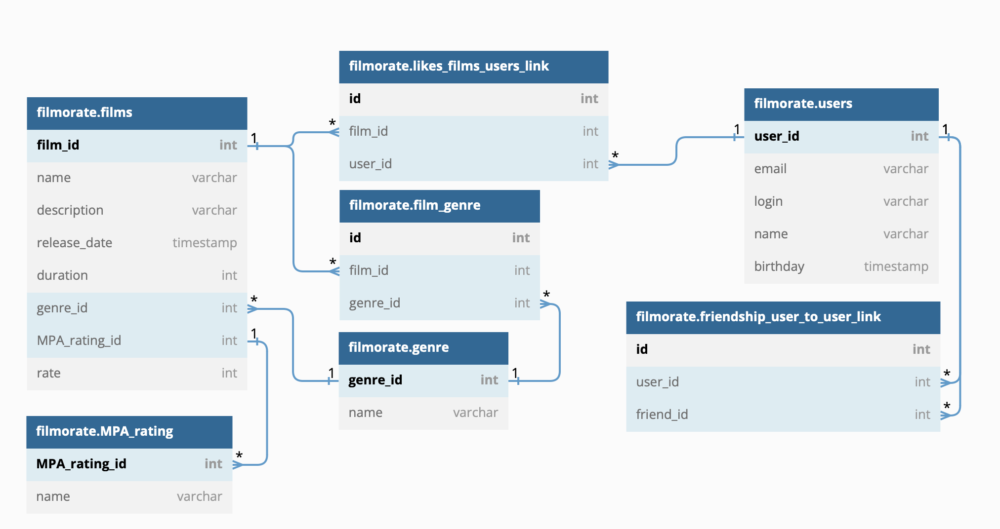

# Filmorate 🎥

Проект социальной сети, которая поможет выбрать кино на основе того, какие фильмы вы и ваши друзья смотрите и какие оценки им ставите. Пользователи могут добавляться в друзья, добавлять редактировать фильмы, оставлять отзывы и оценки, осуществлять поиск фильмов, получать рекомендации к просмотру и выборки самых популярных фильмов.

Монолитное приложение, способное хранить данные в памяти или в базе данных. CRUD и другие запросы к базе данных написаны вручную. Полученные данные обрабатываются с помощью RowMapper.

## Основная функциональность

* Регистрация и получение пользователей
* Добавление пользователей в список друзей
* Добавление, обновление и удаление фильмов
* Поиск фильмов по названию и режиссёру
* Добавление пользовательских отзывов на фильмы

## Схема базы данных

## Инструкция по развёртыванию ▶️
1) Склонируйте репозиторий: https://github.com/Salaia/java-filmorate.git
2) Запустите проект: src/main/java/ru/yandex/practicum/FilmorateApplication.java
3) Проект работает по адресу: http://localhost:8080

## API

Примеры использования программы можно увидеть в приложенных Postman тестах в директории: postman

## 🛠 Tech & Tools

      
      
      
      
    

## Статус и планы по доработке проекта

На данный момент проект проверен и зачтен ревьюером. Планов по дальнейшему развитию проекта нет.

Ссылка на групповой проект: https://github.com/Stepashka37/Filmorate-Application